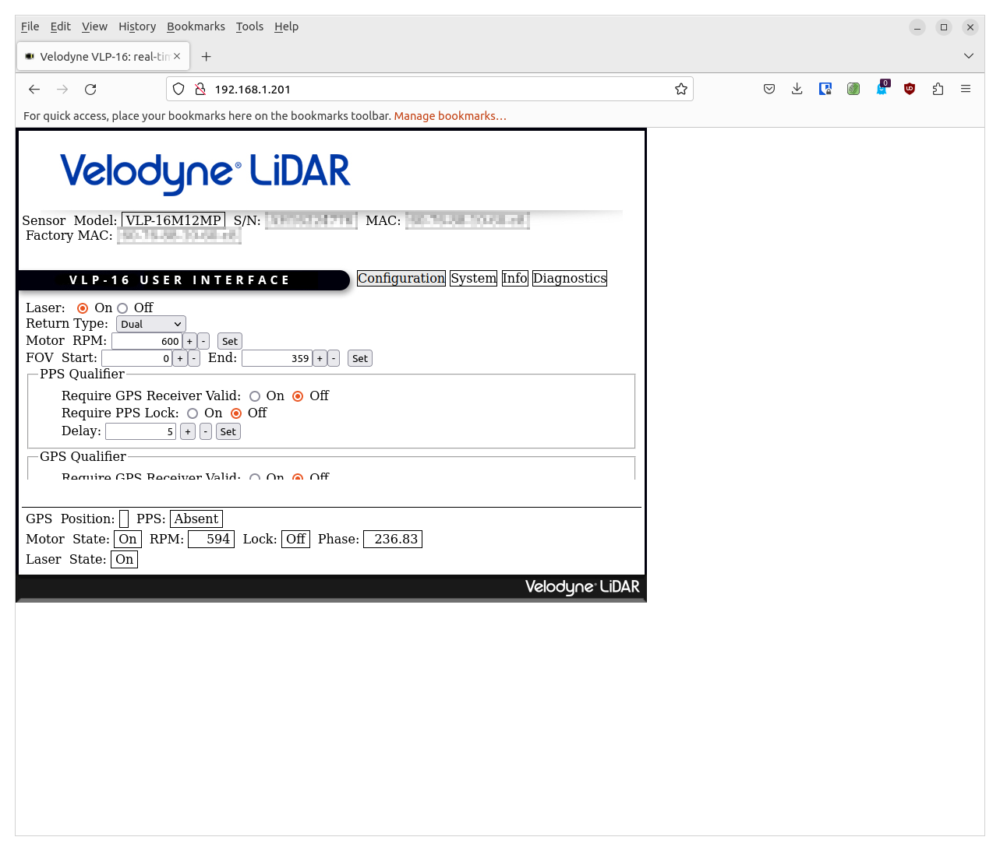
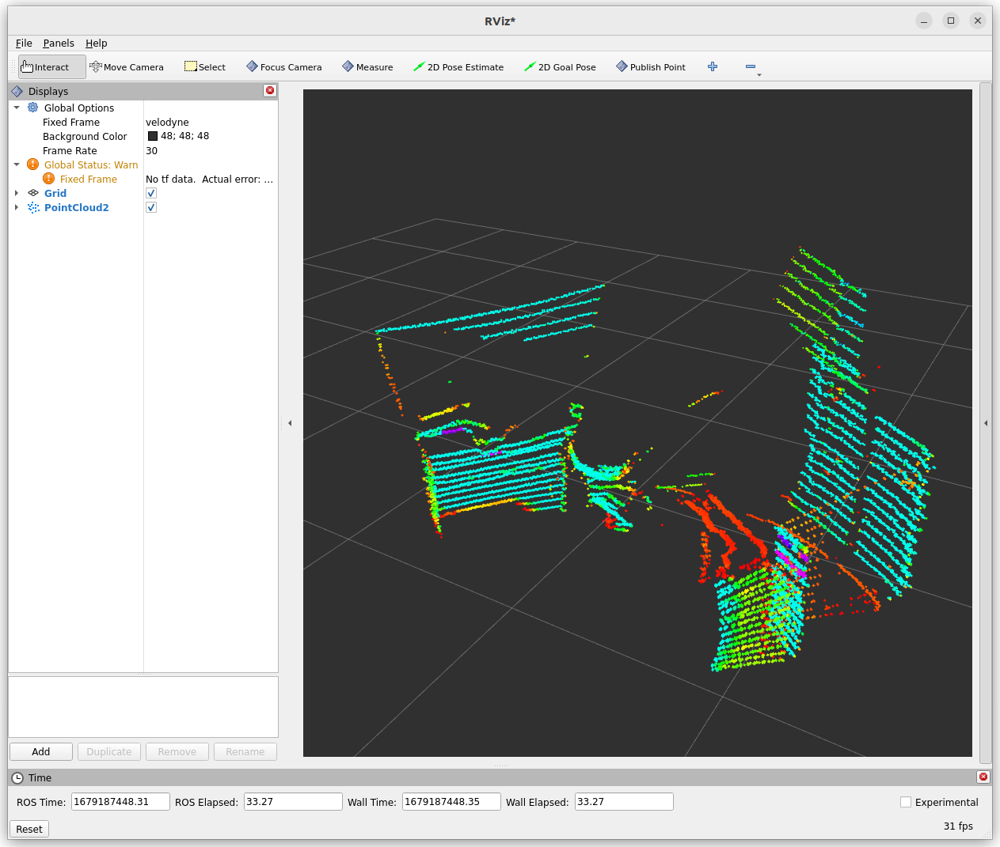

# Velodyne 3D LiDAR ROS 2 Driver (Docker)

[](https://opensource.org/licenses/MIT)

**Modernized Docker setup for Velodyne VLP-16 3D LiDAR with ROS 2 Jazzy**

Based on the original work by [Alfredo Gómez Mendoza](https://github.com/Freddy220103) and [Tobit Flatscher](https://github.com/2b-t).

---

## 📋 Overview

This repository provides a **production-ready Docker environment** for running Velodyne 3D LiDAR sensors (VLP-16, VLP-32C, HDL-32E, HDL-64E) with ROS 2 Jazzy. The setup follows modern DevOps practices with:

- ✅ **Non-root user** for security
- ✅ **CycloneDDS** RMW for better performance
- ✅ **Symlink installs** for faster development
- ✅ **X11 forwarding** for RViz2 GUI
- ✅ **Network isolation** with domain IDs
- ✅ **Volume caching** for performance

The velodyne.zip contains the necessary ROS 2 packages. Extract it to get the velodyne driver packages. 


## 1. Hardware and connections
The Velodyne lidars are common in two different versions, with an **interface box** or with an **8-pin M12 connector** (M12MP-A) only. The ones with interface boxes are generally quite expensive on the second-hand market while the ones with M12 connector often go comparably cheap.

|  |  |
| ------------------------------------------------------------ | ------------------------------------------------------------ |
| Velodyne VLP-16 with interface box                           | Male 8-pin M12 connector                                     |

The interface box already comes with an overcurrent protection and gives you access to an Ethernet port as well as a power connector. For the 8-pin power connector on the other hand you will have to create your own cable. This can though be done with comparably little effort (without cutting the cable). In case you bought one without the interface box have a look at the **[cabling guide](./doc/CablingGuide.md) in this repository for information on making your own cable**.

## 2. Configuring the initial set-up
The set-up is similar to the Velodyne [VLP-16](http://wiki.ros.org/velodyne/Tutorials/Getting%20Started%20with%20the%20Velodyne%20VLP16) and the [HDL-32E](http://wiki.ros.org/velodyne/Tutorials/Getting%20Started%20with%20the%20HDL-32E) lidar in ROS. I recommend to use the following commands, as the last mentioned tutorial is for ROS, not ROS2. As a first step for the ROS2 tutorial we will have to **find out which network interface our lidar is connected to**. For this launch the following command 

```bash
$ for d in /sys/class/net/*; do echo "$(basename ${d}): $(cat $d/{carrier,operstate} | tr '\n' ' ')"; done
```

This will output a list of the available interfaces as well as their connection status:

```bash
br-af62670dc1bb: 0 down 
br-eabc8a210172: 0 down 
docker0: 0 down 
eno1: 0 down 
lo: 1 unknown 
wlx9ca2f491591b: 1 up 
```

Now plug-in the lidar and the corresponding network interface (should start in `en*` due to the [network interface naming convention](https://man7.org/linux/man-pages/man7/systemd.net-naming-scheme.7.html)) should change to `up` when launching the same command again:

```bash
br-af62670dc1bb: 0 down 
br-eabc8a210172: 0 down 
docker0: 0 down 
eno1: 1 up 
lo: 1 unknown 
wlx9ca2f491591b: 1 up 
```

By seeing which one was the one that changed when we connected and disconnected the LiDAR3D, we are able to know which interface name is the one connected to the LiDAR3D. It could be named in different ways such as enps20, en01, enp33, etc.

Now you can [follow the ROS guide to configure your IP address on the host computer](http://wiki.ros.org/velodyne/Tutorials/Getting%20Started%20with%20the%20Velodyne%20VLP16#Configure_your_computer.2BIBk-s_IP_address_through_the_Gnome_interface) for the corresponding network interface (or alternatively follow the [Ubuntu Net Manual](https://help.ubuntu.com/stable/ubuntu-help/net-manual.html.en)) where the configuration is performed via the graphic menu or continue with the following paragraph that performs the same set-up through the command line. Be sure to replace `eno1` with your network interface in the commands below!

Let us check the available connections with `nmcli`:

```bash
$ nmcli connection show
```

Let's create a **new connection**, assigning us the IP address `192.168.1.100`. Feel free to replace `100` with any number between `1` and `254` apart from the one the Velodyne is configured to (`201` by default).

```bash
$ nmcli connection add con-name velodyne-con ifname eno1 type ethernet ip4 192.168.1.100/24
```

Now let's inspect the connection with:

```bash
$ nmcli connection show velodyne-con
```

Let's bring up the connection with the following command:

```bash
$ nmcli connection up id velodyne-con
```

Let's show the IP address of our device:

```bash
$ ip address show dev eno1
```

**[Temporarily configure yourself an IP address](https://ubuntu.com/server/docs/network-configuration) in the `192.168.3.X` range**:

```bash
$ sudo ip addr add 192.168.3.100 dev eno1
```

Set up a **temporary route to the Velodyne**. In case a different address was configured for the Velodyne replace the address below by its address.

```bash
$ sudo route add 192.168.1.201 dev eno1
```

```bash
$ ip route show dev eno1
```

Now you should be able to open the webpage [http://192.168.1.201](http://192.168.1.201) and change the configuration for your Velodyne if desired/needed.



---

## 🗂️ Project Structure

```
velodyne16-ros2/
├── Dockerfile              # ROS 2 Jazzy container definition
├── docker-compose.yaml     # Service orchestration
├── .env.example           # Environment variables template
├── launch/                # Launch files
│   └── velodyne_launch.py # Main launch script
├── params/                # Configuration files
│   └── velodyne.yaml      # Driver parameters
├── rviz/                  # Visualization configs
│   └── velodyne.rviz      # RViz2 setup
├── velodyne/              # ROS 2 packages (from velodyne.zip)
│   ├── velodyne_driver/
│   ├── velodyne_msgs/
│   ├── velodyne_pointcloud/
│   └── velodyne_laserscan/
└── doc/                   # Documentation
    └── CablingGuide.md    # Hardware setup guide
```

---

## 🚀 Quick Start

### 1. Prerequisites

- **Docker** and **Docker Compose** installed
- **Velodyne LiDAR** connected via Ethernet
- **X11 server** running (for RViz2)

### 2. Extract Velodyne Packages

```bash
unzip velodyne.zip
```

### 3. Setup Environment

```bash
# Copy environment template
cp .env.example .env

# Edit with your username
nano .env
```

**Example `.env`:**
```bash
_ROS_USER=your_username
_ROS_DOMAIN_ID=0
UID=1000
```

### 4. Build and Run

```bash
# Allow X11 forwarding
xhost +local:docker

# Build the Docker image
docker compose build

# Start the container
docker compose up
```

### 5. Access Container Shell

```bash
# In a new terminal
docker exec -it velodyne-velodyne_container-1 bash

# Commands are available directly (ROS2 is auto-sourced)
ros2 topic list
ros2 topic hz /velodyne_points
rviz2
```

The Velodyne driver will launch automatically with RViz2 for visualization.

---

## ⚙️ Configuration

### Launch Parameters

Edit `launch/velodyne_launch.py` or pass arguments:

```bash
docker-compose run velodyne_container ros2 launch velodyne velodyne_launch.py device_ip:=192.168.1.201 model:=VLP16 rpm:=600.0
```

**Available parameters:**
- `device_ip`: Velodyne IP address (default: `192.168.1.201`)
- `model`: `VLP16`, `VLP32C`, `HDL32E`, `HDL64E`
- `rpm`: Motor speed (`300`, `600`, `900`, `1200`)
- `frame_id`: TF frame name (default: `velodyne`)
- `port`: UDP port (default: `2368`)
- `pcap`: Path to PCAP file for playback

### Driver Parameters

Edit `params/velodyne.yaml`:

```yaml
device_ip: "192.168.1.201"
model: "VLP16"
rpm: 600.0
min_range: 0.9
max_range: 130.0
```

---

## 🎨 Visualization with RViz2

RViz2 launches automatically with the driver. To customize:

1. Modify `rviz/velodyne.rviz`
2. Restart container: `docker-compose restart`

**Manual launch:**
```bash
docker-compose exec velodyne_container ros2 run rviz2 rviz2 -d ~/ws/src/velodyne/velodyne/rviz/velodyne.rviz
```



---

## 🔧 Development Workflow

### Interactive Shell

```bash
docker-compose run --rm velodyne_container bash
```

### Rebuild Packages

```bash
docker-compose exec velodyne_container bash -c "cd ~/ws && colcon build --symlink-install"
```

### View Topics

```bash
docker-compose exec velodyne_container ros2 topic list
docker-compose exec velodyne_container ros2 topic echo /velodyne_points
```

### Test PCAP Playback

```bash
docker-compose run velodyne_container ros2 launch velodyne velodyne_launch.py pcap:=/path/to/file.pcap
```

---

## 📊 Published Topics

| Topic | Type | Description |
|-------|------|-------------|
| `/velodyne_packets` | `velodyne_msgs/VelodyneScan` | Raw packet data |
| `/velodyne_points` | `sensor_msgs/PointCloud2` | 3D point cloud (16 rings) |
| `/scan` | `sensor_msgs/LaserScan` | 2D laser scan (single ring) |

---

## 🎯 Calibration Files

The driver needs the correct calibration file for your LiDAR model:

| Model | Calibration File | Vertical FOV |
|-------|------------------|--------------|
| VLP-16 Standard | `VLP16db.yaml` | -15° to +15° (30°) |
| VLP-16 Puck Hi-Res | `VLP16_hires_db.yaml` | -10° to +10° (20°) |
| VLP-32C | `VeloView-VLP-32C.yaml` | -25° to +15° |

The calibration file is set in `launch/velodyne_launch.py`:

```python
calibration_file = os.path.join(
    get_package_share_directory('velodyne_pointcloud'),
    'params', 'VLP16_hires_db.yaml'  # Change based on your model
)
```

---

## 🖥️ RViz2 Configuration

After launching, configure RViz2 for optimal visualization:

1. **Fixed Frame**: Set to `velodyne`
2. **Add PointCloud2**: Topic `/velodyne_points`
3. **Reliability Policy**: `Best Effort` (reduces lag)
4. **Decay Time**: `0.1` - `0.5` (stabilizes display)
5. **Color Transformer**: `Intensity` or `AxisColor`

### Performance Tips for Jetson/ARM

If experiencing "queue is full" warnings:
- Set **Reliability Policy** to `Best Effort`
- Increase **Decay Time** to `0.3`
- Reduce **Frame Rate** to `10-15`

---

## 🐛 Troubleshooting

### Can't ping Velodyne

```bash
# Check interface status
ip addr show <YOUR_INTERFACE>

# Add temporary route
sudo route add 192.168.1.201 dev <YOUR_INTERFACE>
```

### No points in RViz2

1. Check Fixed Frame is set to `velodyne` (not `map`)
2. Check topic: `ros2 topic hz /velodyne_points`
3. Verify IP: `ros2 param get /velodyne_driver device_ip`
4. Check firewall: `sudo ufw allow 2368/udp`
5. Verify calibration file matches your LiDAR model

### Points appear as single line

- Wrong calibration file for your model
- LiDAR not horizontal (check physical orientation)
- Objects too close (increase `min_range`)

### "queue is full" warnings in RViz2

This is a performance issue on low-power devices (Jetson):
- Set Reliability Policy to `Best Effort`
- Increase Decay Time
- Reduce Frame Rate

### X11 connection refused

```bash
# Allow Docker to access X11
xhost +local:docker
```

### Permission denied on /dev

The container runs in `privileged` mode to access network devices. If issues persist:

```bash
# Add user to dialout group
sudo usermod -aG dialout $USER
```

---

## 📚 Documentation

- **[Cabling Guide](./doc/CablingGuide.md)**: DIY M12 connector cable
- **[Velodyne Manual](https://velodynelidar.com/products/puck/)**: Official hardware docs
- **[ROS 2 Velodyne](https://github.com/ros-drivers/velodyne)**: Upstream driver repository

---

## 🏗️ Architecture

### Dockerfile Highlights

- **Base Image**: `ros:jazzy`
- **RMW**: CycloneDDS (faster than default FastDDS)
- **User**: Non-root with sudo access
- **Build**: Multi-stage with bind mounts
- **Entrypoint**: Auto-sources ROS setup

### Docker Compose Features

- **Network**: Host mode for direct LiDAR access
- **Volumes**: Live code reload with caching
- **Environment**: Domain ID isolation
- **IPC/PID**: Shared with host for performance

---

## 🤝 Contributing

Contributions welcome! Please:

1. Fork the repository
2. Create a feature branch
3. Test with real hardware
4. Submit a pull request

---

## 📄 License

MIT License - see [License.md](./License.md) for details.

---

## 🙏 Acknowledgments

- **ROS Drivers Community**: Velodyne driver maintenance
- **Alfredo Gómez Mendoza**: Original Docker implementation
- **Tobit Flatscher**: Documentation and improvements

---

## 📞 Support

For issues or questions:

- **Hardware**: Refer to [CablingGuide.md](./doc/CablingGuide.md)
- **Software**: Open a GitHub issue
- **ROS 2 Help**: [ROS 2 Discourse](https://discourse.ros.org/)

**Happy LiDARing! 🌟**
